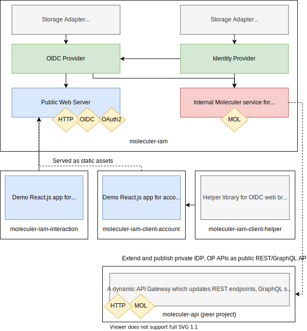
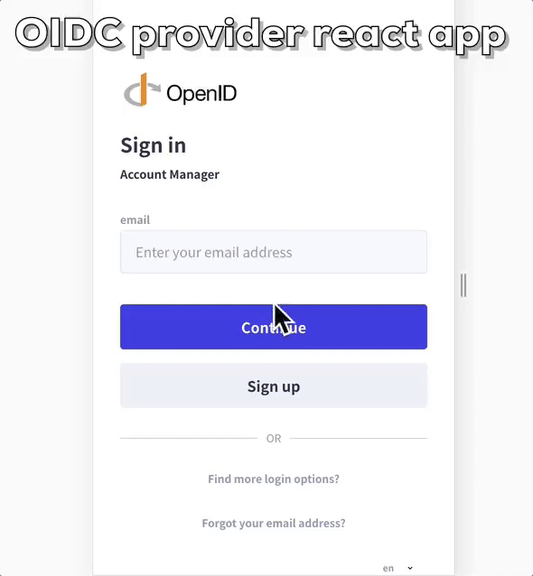
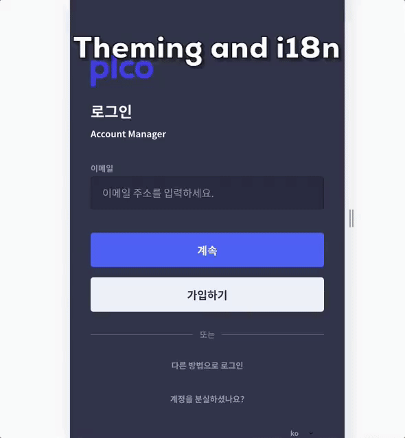
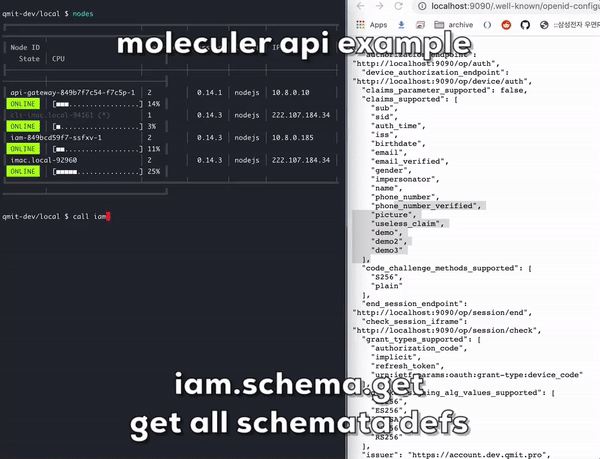

# Introduction

## moleculer-iam

Centralized IAM module for moleculer. Including a certified OIDC provider and an Identity provider for user profile, credentials, and custom claims management feature. Custom claims could be defined/updated by declarative schema which contains claims validation and migration strategy. Also including default interaction React.js application for login/logout/registration and other OP interactions, and the account management React.js application.

[](https://travis-ci.org/qmit-pro/moleculer-iam) [](https://coveralls.io/github/qmit-pro/moleculer-iam?branch=master) [](https://david-dm.org/qmit-pro/moleculer-iam) [](https://snyk.io/test/github/qmit-pro/moleculer-iam) [](https://www.npmjs.com/package/moleculer-iam) [](https://moleculer.services)



## Features

* Identity Provider
  * based on RDBMS
  * declarative claims schema definition for validation
  * dynamic update for claims schema and scope
  * versioned claims with robust claims schema migration support
  * each identities are cached as JSON value for performance
  * support complex query for fetching identity
  * basic OpenID claims battery included
  * ready for distributed system
* OpenID Connect Provider
  * based on `panva/node-oidc-provider`
  * OpenID certified library
  * ready for basic interactions for below react app
  * federation presets for google and facebook, kakaotalk based on passport, also extendable
  * support i18n; for now ko-KR, en-US
* Moleculer integrated actions and events
  * manage IDP claims schema and identity
  * manage OP client and other models
* React App for OP interaction rendering
  * based on `react-native-ui-kitten` and `react-navigation`
  * session based
  * support i18n; for now ko-KR, en-US 
  * support login/logout/register/findEmail/resetPassword/verifyEmail/verifyPhone/consent
  * support theming and various customization option without rebuild from server configuration
  * this whole app can be replaced to custom one from server configuration

## Demo

### OpenID Connect Provider and React web application

 

### Dynamically define claims schema



### Internal moleculer service actions

```text
════════════════════════════════════════════════════════════════════════════════════════════════════════════════════
╟ action                     │Params
╟────────────────────────────┼──────────────────────────────────────────────────────────────────────────────────────
║ iam.client.count           │ where                                                                       
║ iam.client.create          │ client_id, client_name, client_secret, client_uri, logo_uri, policy_uri, ...
║ iam.client.delete          │ id                                                                          
║ iam.client.find             │ id                                                                          
║ iam.client.get             │ where, offset, limit                                                        
║ iam.client.update          │ client_id, client_name, reset_client_secret, client_secret, client_uri, logo
║ iam.id.count               │ where                                                                       
║ iam.id.create              │ scope, metadata, claims, credentials                                        
║ iam.id.delete              │ id, permanently                                                             
║ iam.id.find                 │ id, email, phone_number, where, scope                                       
║ iam.id.get                 │ where, offset, limit, scope
║ iam.id.refresh             │ id, where                                                                   
║ iam.id.restore             │ id                                                                          
║ iam.id.update              │ id, scope, claims, metadata, credentials                                    
║ iam.id.validate            │ id, scope, claims, credenti                                              
║ iam.id.validateCredentials │ password                                                                    
║ iam.model.count            │ kind, where                                                                 
║ iam.model.delete           │ kind, where, offset, limit                                                  
║ iam.model.get              │ kind, where, offset, limit                                                  
║ iam.schema.define           │ scope, key, description, unique, immutable, validation, migration, parentVersion, ...
║ iam.schema.find             │ key, version, active                                                         
║ iam.schema.get             │ scope, key, version, active                                                  
╚════════════════════════════╧═══════════════════════════════════════════════════════════════════════════════════════
```

## Usage

### 1. Documents

* [Features and details: ./docs](https://github.com/qmit-pro/moleculer-iam/tree/eede29fa3fc37f69e6e34b6b489b3b85ea57ddb8/docs/README.md)

### 2. Examples

* [MoleculerJs: ./src/examples](https://github.com/qmit-pro/moleculer-iam/tree/eede29fa3fc37f69e6e34b6b489b3b85ea57ddb8/examples/README.md)

### 3. Quick Start

```text
yarn add moleculer-iam
```

...

## Development

### build

* `yarn build-all`

### 1. moleculer-iam

#### OIDC Provider + IDP + Moleculer service

* `yarn workspace moleculer-iam dev [example=simple]` - Start development with [./examples](https://github.com/qmit-pro/moleculer-iam/tree/eede29fa3fc37f69e6e34b6b489b3b85ea57ddb8/examples/README.md) \(nodemon with ts-node\)
* `yarn workspace moleculer-iam lint` - Run TSLint
* `yarn workspace moleculer-iam build`- Transpile ts to js 
* `yarn workspace moleculer-iam deps`- Update dependencies
* `yarn workspace moleculer-iam test` - Run tests & generate coverage report
* `yarn workspace moleculer-iam test --watch` - Watch and run tests

### 2. moleculer-iam-app

#### React Application for OIDC interactions with browser

* `yarn workspace moleculer-iam-app dev` - Start Server Application development \(webpack\)
* `yarn workspace moleculer-iam-app build`- Transpile client-side ts/tsx to js 
* `yarn workspace moleculer-iam-app build-server`- Transpile server-side ts to js
* `yarn workspace moleculer-iam-app test` - Run tests

## Contribution

Please send pull requests improving the usage and fixing bugs, improving documentation and providing better examples, or providing some testing, because these things are important.

## License

The project is available under the [MIT license](https://tldrlegal.com/license/mit-license).

## Contact

Copyright \(c\) 2019 QMIT Inc.

